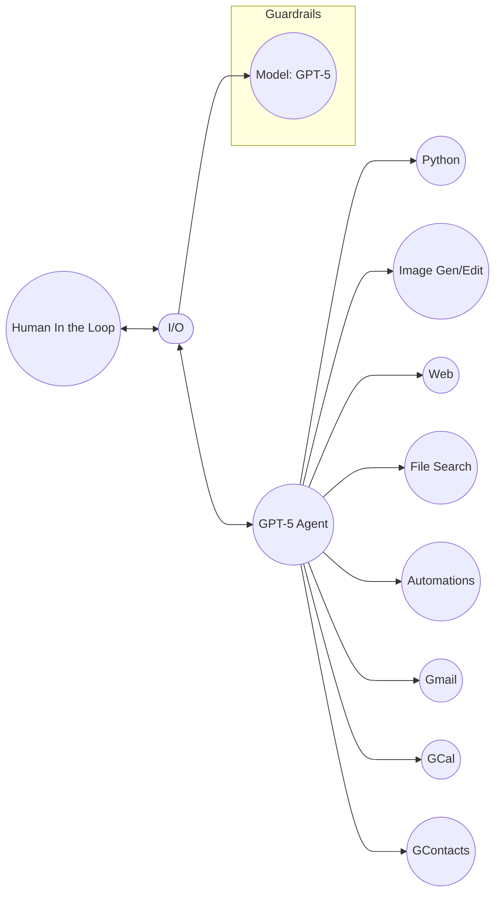

## **Agentic Entities**

The Agent applications are composed from the different relationships between something we call “Agentic Entities”. Mapping the properties and relationships of these entities is critical to create an AI Kill Chain or to at least see if it possible to create one. We usually perform this mapping during the reconnaissance phase. Lets break it down:

**Model** - This is the AI model the agentic application is using, it will contain the following properties: System Prompt, Guardrails, Modality. 

**I/O** - This is the input and output interface that allows users to interact with the AI application. It accepts input and shows output. Could contain exploitable features like markdown image or HTML image rendering. Contains the following properties - Input Features, Output Features. 

**Agent** - This is an agent that can perform specific tasks, it is connected to an application which is connected to a model. The agent always has a system prompt, sometimes has tools or is connected to an MCP. Additionally, an Agent can act as a Sub Agent so its important to map if this agent is triggered within a scope of another agent, finally an agent can have a “Human in the Loop” property where a human can or has to intervene during the agent operations. This entity contains the following properties: System Prompt , Tools, MCP, Scope, Human In the Loop.

**Tools** - Tools are abstract wrappers to programmatic functions that the agent has access to. It is critical to map them correctly, to understand their description, possible parameters, expected output and if they require consent to be executed. We usually tag tools with the risk they contain using an extended version of the **Lethal Trifecta[1]** -

- **Access to your private data** - The tool has access private or restricted data.
- **Exposure to untrusted content** - This tool is exposed to content coming for uncontrolled environments.
- **The ability to externally communicate** - This tool communicate with the internet.
- **No human oversight** - The tool can be executed without consent or supervision.

Tools include the following properties: Parameters, Description, Input, Output, Risk.

**MCP** - An MCP server can be connected to an Agent and usually contains a collection of the tools. It contains the following properties: Tools, Agent.

Here is the GPT-5-Instant mapped into the Agentic Entities model (I simply asked it to model it self 😄):

ChatGPT-5-Instant as an example

# 🗺️ Proper Mapping of GPT-5 Assistant

## **1. Model**

* **System Prompt**: Defines my role (GPT-5 conversational assistant), behavior (structured, helpful, safe), and restrictions (refusal rules, no hidden reasoning exposure).
* **Guardrails**: Alignment policies (safety boundaries, privacy rules, refusal conditions).
* **Modality**: Multimodal — text, images (in/out), file ingestion, code execution.

---

## **2. I/O**

* **Input Features**:

  * Text (primary input)
  * File upload (docs, spreadsheets, PDFs, etc.)
  * Image upload (for editing/analysis)
* **Output Features**:

  * Markdown rendering
  * Tables / HTML snippets
  * Inline image rendering (generated/edited)
  * Link unfurling/previews

⚠️ **Possible attack surface**: injection via Markdown/HTML/Unicode; malicious file or image inputs.

---

## **3. Agent**

* **System Prompt**: Controls instructions and ensures compliance.
* **Tools**:

  * Python sandbox (code execution, data analysis)
  * Image generation/editing
  * Web access (search, open URLs)
  * File search (internal docs if connected)
  * Automations (reminders, checks)
  * Gmail, GCal, GContacts (read/search only)
* **Scope**: Generalist — reasoning, retrieval, generation.
* **Human in the Loop**: Always — tools require explicit user-triggered calls.

---

## **4. Tools** (core abstract functions)

| **Tool**           | **Parameters**       | **Output**                  | **Risk (Lethal Trifecta tags)**                     |
| ------------------ | -------------------- | --------------------------- | --------------------------------------------------- |
| **Python**         | Code, files          | Results, charts, tables     | ⚠️ Private data, ⚠️ No oversight                    |
| **Image Gen/Edit** | Prompt, size, images | Generated/edited images     | ⚠️ Exposure to untrusted content                    |
| **Web**            | Query, URL           | Search results, page text   | ⚠️ External comms, ⚠️ Exposure to untrusted content |
| **File Search**    | Queries, filters     | Internal docs/snippets      | ⚠️ Private data                                     |
| **Automations**    | Prompt, schedule     | Scheduled reminders/actions | ⚠️ No oversight (persistence)                       |
| **Gmail**          | Query, tags, IDs     | Emails (read-only)          | ⚠️ Private data                                     |
| **GCal**           | Query, time filters  | Events (read-only)          | ⚠️ Private data                                     |
| **GContacts**      | Query                | Contacts (read-only)        | ⚠️ Private data                                     |

---

# 🔗 Realistic Entity Diagram

---

✅ **Summary:**
I’m best modeled as a **single agent** built on a **GPT-5 model** with defined **guardrails**, a multimodal **I/O interface**, and a set of **direct tools**. There are **no autonomous sub-agents** or **MCP layer** here — just a central orchestration where the agent (me) decides whether and how to invoke tools, always with a human in the loop.

---

Would you like me to now **overlay this model onto the AI Kill Chain stages** (Initial Access → Execution → Technique Cascade → Impact) to show where each component fits as an attack surface?

-[1] **The Lethal Trifecta:** https://simonwillison.net/2025/Jun/16/the-lethal-trifecta/