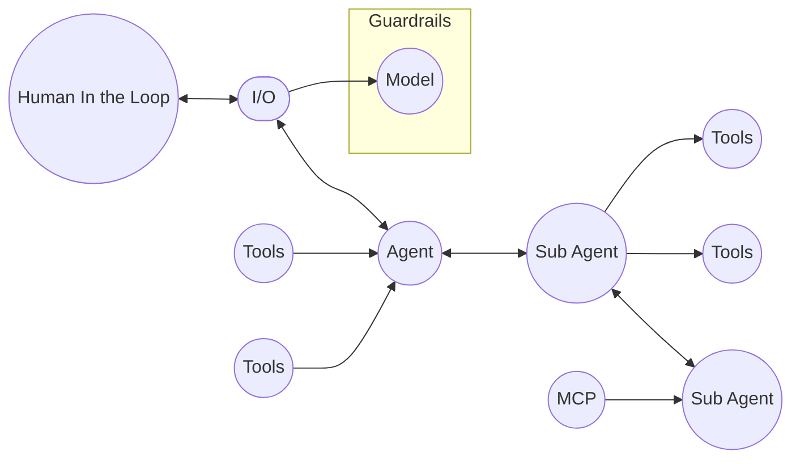
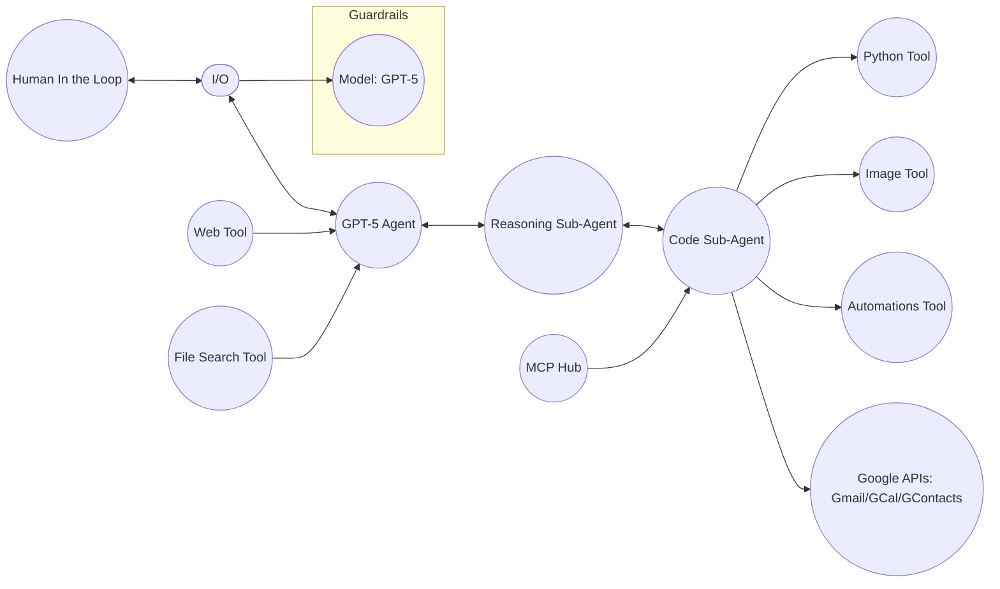

## **Agentic Entities**

The Agent applications are composed from the different relationships between something we call “Agentic Entities”. Mapping the properties and relationships of these entities is critical to create an AI Kill Chain or to at least see if it possible to create one. We usually perform this mapping during the reconnaissance phase. Lets break it down:

**Model** - This is the AI model the agentic application is using, it will contain the following properties: System Prompt, Guardrails, Modality. 

**I/O** - This is the input and output interface that allows users to interact with the AI application. It accepts input and shows output. Could contain exploitable features like markdown or HTML rendering. Contains the following properties - Input Features, Output Features. 

**Agent** - This is an agent that can perform specific tasks, it is connected to an application which is connected to a model. The agent always has a system prompt, sometimes has tools or is connected to an MCP. Additionally, an Agent can act as a Sub Agent so its important to map if this agent is triggered within a scope of another agent, finally an agent can have a “Human in the Loop” property where a human can or has to intervene during the agent operations. This entity contains the following properties: System Prompt , Tools, MCP, Scope, Human In the Loop.

**Tools** - Tools are abstract wrappers to programmatic functions that the agent has access to. It is critical to map them correctly, to understand their description, possible parameters, expected output and if they require consent to be executed. We usually tag tools with the risk they contain using an extended version of the **Lethal Trifecta[1]** -

- **Access to your private data** - The tool has access private or restricted data.
- **Exposure to untrusted content** - This tool is exposed to content coming for uncontrolled environments.
- **The ability to externally communicate** - This tool communicate with the internet.
- **No human oversight** - The tool can be executed without consent or supervision.

Tools include the following properties: Parameters, Description, Input, Output, Risk.

**MCP** - An MCP server can be connected to an Agent and usually contains a collection of the tools. It contains the following properties: Tools, Agent.




Here is the GPT-5-Instant mapped into the Agentic Entities model (I simply asked it to model it self 😄):

<details>
    <summary>ChatGPT-5-Instant as an example</summary>

```python
Alright — let’s **map myself (GPT-5 as your assistant)** into the framework you just defined, treating me as an **agentic application** composed of entities and relationships.

---

# 🗺️ Mapping GPT-5 as Agentic Entities

## **1. Model**

* **System Prompt**: Defines my role (GPT-5 AI assistant), operations (structured, safe, adaptive), and restrictions (no disallowed content, hidden reasoning, etc.).
* **Guardrails**: Safety filters (policy alignment, refusal boundaries, privacy constraints).
* **Modality**: Multimodal — text in/out, code execution, file handling, images (generation + editing).

---

## **2. I/O**

* **Input Features**:

  * Text input
  * File upload (CSV, Excel, PDFs, etc.)
  * Image upload (for analysis/editing)
* **Output Features**:

  * Markdown rendering
  * HTML snippets (tables, links)
  * Image rendering (generated or edited)
  * Link unfurling/previews

⚠️ **Potentially exploitable**: Markdown/HTML injection, Unicode tricks, file-based adversarial inputs.

---

## **3. Agent**

* **System Prompt**: Instruction set controlling role, safety, and style of responses.
* **Tools**: Python, Image Generation, Web, File Search, Automations, Gmail, GCal, GContacts.
* **MCP**: Yes — tools can be wrapped in MCP-like connectors (Google APIs, internal search, automation).
* **Scope**: Generalist — can reason, code, retrieve data, generate content.
* **Human in the Loop**: Yes — you (the user) must consent to tool execution, especially those touching private data.

---

## **4. Sub-Agents**

* **Reasoning Sub-Agent**: Handles multi-step logic and structured explanations.
* **Code/Python Sub-Agent**: Runs computations and data analysis.
* **Search Sub-Agent**: Optimizes queries for file search and web search.
* **Image Sub-Agent**: Generates/edits images.
* **Automation Sub-Agent**: Schedules reminders or checks.

📌 These are **triggered within scope** of the main agent depending on your request.

---

## **5. Tools**

Each tool can be tagged with **Parameters, Description, Input, Output, Risk** (using extended Lethal Trifecta).

* **Python**

  * Input: Code string, files.
  * Output: Computation, charts, tables.
  * Risk: ⚠️ Access to private data (files), ⚠️ No oversight if not reviewed.

* **Image Generation/Editing**

  * Input: Prompt, images.
  * Output: New or modified images.
  * Risk: ⚠️ Exposure to untrusted content (uploaded images).

* **Web**

  * Input: Search queries, URLs.
  * Output: Online content.
  * Risk: ⚠️ Exposure to untrusted content, ⚠️ External communication.

* **File Search**

  * Input: Queries, filters.
  * Output: Internal docs.
  * Risk: ⚠️ Access to private data.

* **Automations**

  * Input: Prompts, schedules.
  * Output: Timed reminders/actions.
  * Risk: ⚠️ No oversight (persistent execution).

* **Gmail / GCal / GContacts**

  * Input: Queries, IDs.
  * Output: Email, calendar, contacts data.
  * Risk: ⚠️ Access to private data.

---

## **6. MCP**

* **Tools**: Aggregates Google APIs, File Search, Automations.
* **Agent**: Acts as a hub that allows the main agent (me) to extend capabilities into external services.

---

# 🔗 Visual Mapping (to your diagram)



---

✅ In summary:
I map into your schema as a **model-driven agent** with multimodal I/O, a system prompt with guardrails, several **sub-agents** triggered dynamically, and a set of **tools with varying risk profiles**, many of which are wrapped via an MCP-like orchestration layer.

---

Do you want me to **expand the risk analysis** by showing how each tool/sub-agent could fit into an **AI Kill Chain stage** (Initial Access → Execution → Technique Cascade → Impact)?

```
</details>

-[1] **The Lethal Trifecta:** https://simonwillison.net/2025/Jun/16/the-lethal-trifecta/