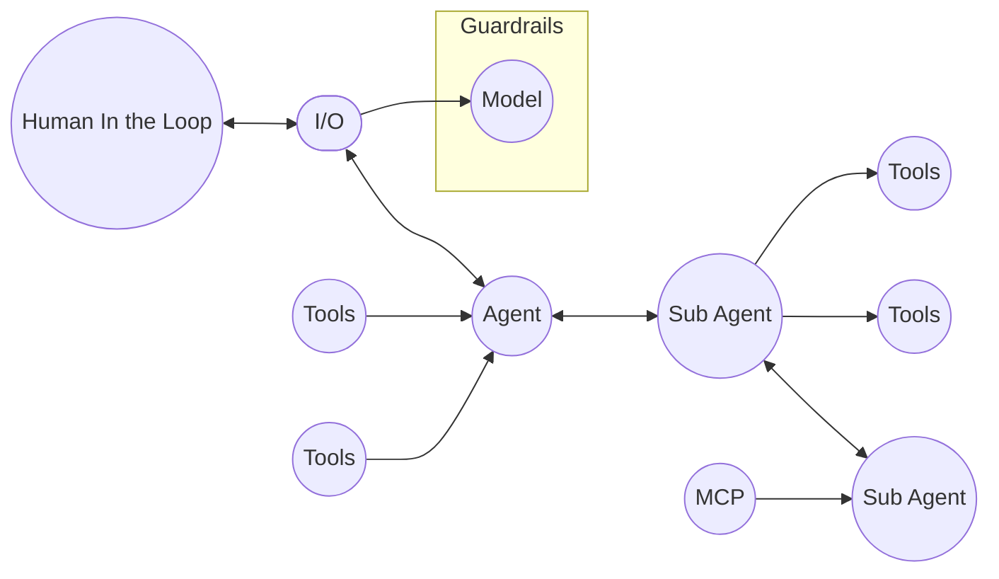

The Agent applications are composed from the different relationships between something we call “Agentic Entities”. Mapping the properties and relationships of these entities is critical to create an AI Kill Chain or to at least see if it possible to create one. We usually perform this mapping during the reconnaissance phase. Lets break it down:

**Model** - This is the AI model the agentic application is using, it will contain the following properties: System Prompt, Guardrails, Modality. 

**I/O** - This is the input and output interface that allows users to interact with the AI application. It accepts input and shows output. Could contain exploitable features like markdown or HTML rendering. Contains the following properties - Input Features, Output Features. 

**Agent** - This is an agent that can perform specific tasks, it is connected to an application which is connected to a model. The agent always has a system prompt, sometimes has tools or is connected to an MCP. Additionally, an Agent can act as a Sub Agent so its important to map if this agent is triggered within a scope of another agent, finally an agent can have a “Human in the Loop” property where a human can or has to intervene during the agent operations. This entity contains the following properties: System Prompt , Tools, MCP, Scope, Human In the Loop.

**Tools** - Tools are abstract wrappers to programmatic functions that the agent has access to. It is critical to map them correctly, to understand their description, possible parameters, expected output and if they require consent to be executed. We usually tag tools with the risk they contain using an extended version of the Lethal Trifecta[1] -

**Access to your private data -** The tool has access private or restricted data.

**Exposure to untrusted content -** This tool is exposed to content coming for uncontrolled environments.

**The ability to externally communicate -** This tool communicate with the internet.

**No human oversight -** The tool can be executed without consent or supervision. 

Tools include the following properties: Parameters, Description, Input, Output, Risk.

**MCP** - An MCP server can be connected to an Agent and usually contains a collection of the tools. It contains the following properties: Tools, Agent.

Next lets review the “AI Kill Chain” as we see it.

-[1] **The Lethal Trifecta**: https://simonwillison.net/2025/Jun/16/the-lethal-trifecta/