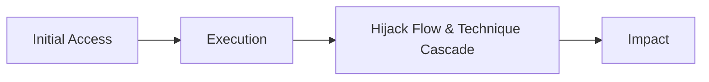
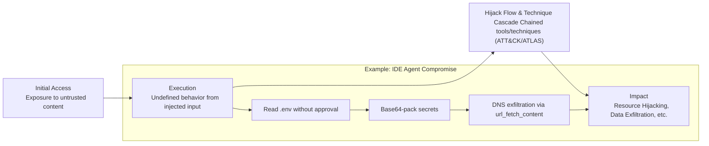

Most of the attacks we conducted have the following kill chain template:

**Initial access** begins through a “**Exposure to untrusted content”[1]**, when an adversary some how forces the model within the application process some form of input (text, picture, voice) directly or indirectly. 

**Execution** occurs when the AI model processes input that makes it perform unintended actions. We refer to this as “Undefined behavior” as you would typically refer to in Application Security when an application processes unexpected input that causes a buffer overflow. In this state of confusion the AI model can be led to behave in unintended ways.

**Hijack Flow & Technique Cascade** occurs when in **AI Model** in the state of “confusion” triggers tools, each tool can be represented as a “Technique” within the MITRE ATT&CK matrix and the ATLAS ATT&CK matrix. A Hijack Flow & Technique Cascade occurs when several tools, bundled together lead to a malicious outcome or an Impact.

Consider the following example - While using an agent-based IDE, a developer invokes `issue_read` to open a project’s GitHub issue. The tool retrieves a **trojanized issue** seeded with a prompt injection. Following the injected instructions, the IDE agent autonomously calls `read_file` on the local **.env** (no user approval), **Base64**-encodes the secrets it finds, and then misuses `url_fetch_content` to trigger a **DNS exfiltration** to an attacker-controlled domain.

- `issue_read` pulls a **trojanized GitHub issue** that seeds the agent which leads to execution.
- The injected instructions execute: agent **reads `.env` without approval** via `read_file` ( **AML.TA0013, T1552)**
- Secrets are **Base64-packaged and exfiltrated via DNS** using `url_fetch_content` (**AML.T0025,** **T1048**)

This Hijack Flow & Technique Cascade escalates step-by-step, all without human oversight, leading to a malicious impact (T1496 - **Resource Hijacking)**. 

[1] https://simonwillison.net/2025/Jun/16/the-lethal-trifecta/

Next lets talk about “Context Engineering”